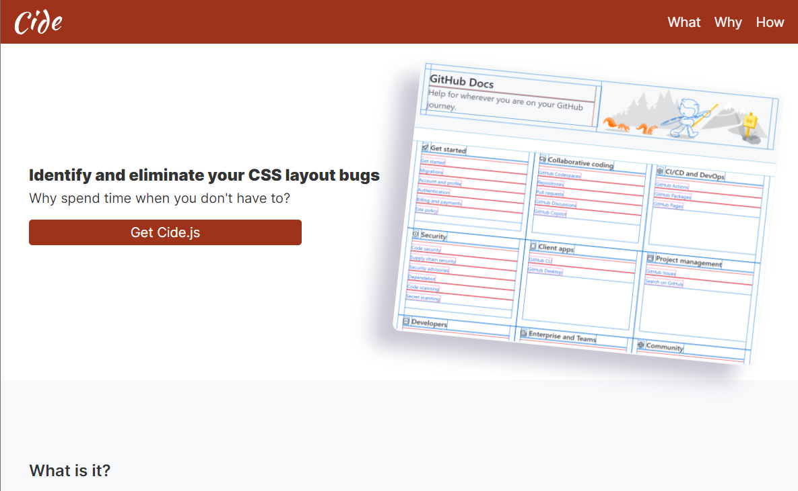

# Cide

Identify and eliminate CSS layout problems.

## What is it?

A tool that assists with project layout problems. It is a fork of [Pesticide](https://github.com/mrmrs/pesticide) that I found useful in my development. I extended the functionality to be keyboard key press activated with the options to toggle between the standard outline option or the enhanced option with box shadow to show element depth on hover.

## Why use it?

Sometimes you need to tell elements apart to identify what's causing the layout issue. This is where this tool comes in and shines.

## How to use it?

Choose the most effective solution for your use case below.

### Quick Usage

Drag the bookmarklet link from the info page to your bookmarks or right click and bookmark it.

Copy and paste the script below and add it to your project or platform that allows external script files (SRI by www.srihash.org).

    

### Offline Usage

Click the download button from the info page for the JavaScript file to add to your project locally.

### Option Controls

Use the following keyboard combination to activate and deactivate the tool.

Ctrl + mouseover or Cmd + mouseover to display element attributes

Focus on page then, Ctrl + ~ or Cmd + ~ to enable Outline option

Focus on page then, Ctrl + 1 or Cmd + 1 to enable Outline and Box Shadow option

Focus on page then, Ctrl + 2 or Cmd + 2 to disable any active option

Alternatively,

Focus on page then, Ctrl + Previous Key option Pressed or Cmd + Previous Key option Pressed to disable the active option
